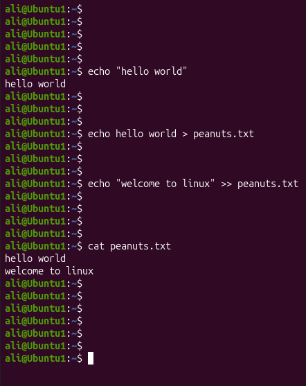

# Linux Project 01 - Standard Output (stdout)

## Objective

Learn how to use Standard Output (stdout) and redirect command output into files using the `>` and `>>` operators.

---

## Scenario

You are a Junior Linux System Administrator.

Your manager asks you to practice stdout redirection so you can save command output into files instead of displaying it only on the terminal.

---

## What is Standard Output (stdout)?

Standard Output (stdout) is the default place where Linux commands send their output.

By default, stdout displays the output on the terminal screen.

### Example

```bash
echo Hello World
```

Output

```
Hello World
```

---

## Redirecting stdout with >

The `>` operator redirects the output of a command into a file.

- Creates the file if it does not exist.
- Overwrites the file if it already exists.

### Example

```bash
echo Hello World > peanuts.txt
```

Contents of **peanuts.txt**

```
Hello World
```

---

## Appending stdout with >>

The `>>` operator appends output to the end of a file.

- Creates the file if it does not exist.
- Does not overwrite existing content.

### Example

```bash
echo Linux >> peanuts.txt
```

Contents of **peanuts.txt**

```
Hello World
Linux
```

---

## Project File

- project.sh - Practice stdout redirection using `>` and `>>`

---

## Screenshots

### Project



---

## What I Learned

- Understand Standard Output (stdout)
- Redirect command output using `>`
- Append output using `>>`
- Create files using output redirection
- Prevent overwriting files by using append redirection