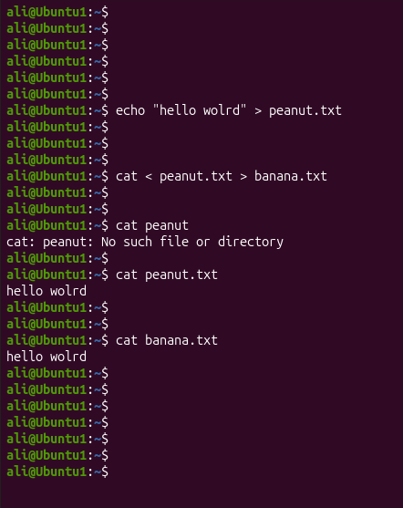

# Linux Project 02 - Standard Input (stdin)

## Objective

Learn how to use Standard Input (stdin) and redirect input from one file to another using the `<` and `>` operators.

---

## Scenario

You are a Junior Linux System Administrator.

Your manager asks you to practice stdin redirection so you can read data from a file instead of typing it manually.

---

## What is Standard Input (stdin)?

Standard Input (stdin) is the default input source for Linux commands.

By default, stdin comes from the keyboard.

### Example

```bash
cat
```

The `cat` command waits for you to type text.

Example:

```
Hello Linux
```

Press **Ctrl + D** to finish.

Output

```
Hello Linux
```

---

## Redirecting stdin with `<`

The `<` operator tells a command to read its input from a file instead of the keyboard.

### Example

```bash
cat < peanuts.txt
```

If **peanuts.txt** contains:

```
Hello World
```

Output

```
Hello World
```

---

## Redirecting stdin and stdout Together

You can combine `<` and `>` in one command.

### Example

```bash
cat < peanuts.txt > banana.txt
```

What happens?

- `cat` reads the contents of **peanuts.txt**
- The output is written into **banana.txt**

If **banana.txt** does not exist, Linux creates it.

If it already exists, Linux overwrites its contents.

Example:

**peanuts.txt**

```
Hello World
```

After running:

```bash
cat < peanuts.txt > banana.txt
```

**banana.txt**

```
Hello World
```

---

## Project File

- project1.sh - Practice stdin and stdout redirection

---

## project1.sh

```bash
#!/bin/bash

# Create a file
echo "Hello World" > peanuts.txt

# Copy the contents into another file
cat < peanuts.txt > banana.txt

# Display the copied file
cat banana.txt
```

---

## Run the Project

Make the script executable.

```bash
chmod +x project1.sh
```

Run the script.

```bash
./project1.sh
```

---

## Screenshots

### Project



---

## What I Learned

- Understand Standard Input (stdin)
- Understand Standard Output (stdout)
- Read input from a file using `<`
- Write output to a file using `>`
- Copy the contents of one file into another using `cat`
```