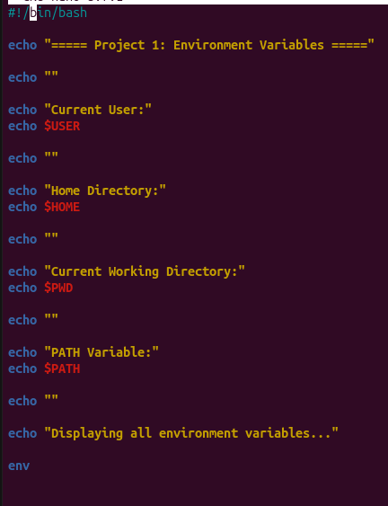
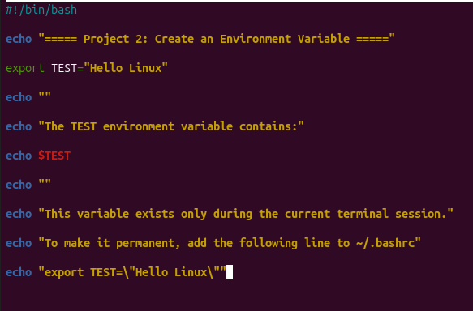

# Linux Project 05 - Environment Variables (env)

## Objective

Learn how to view, create, and manage Linux environment variables using the `env`, `echo`, and `export` commands.

---

## Scenario

You are a Junior Linux System Administrator.

Your manager asks you to practice working with Linux environment variables to better understand how the shell stores system information.

---

# What is an Environment Variable?

An environment variable is a variable that stores information about your current Linux session.

Examples include:

- Username
- Home directory
- Current working directory
- Command search path

---

# Viewing Environment Variables

You can display the value of an environment variable using the `echo` command.

### Syntax

```bash
echo $VARIABLE_NAME
```

Example

```bash
echo $HOME
```

Displays your home directory.

Another example

```bash
echo $USER
```

Displays your current username.

---

# The env Command

The `env` command displays all environment variables currently available in your shell.

### Syntax

```bash
env
```

Example Output

```text
HOME=/home/ali
USER=ali
PWD=/home/ali
PATH=/usr/bin:/bin
```

---

# The PATH Variable

The `PATH` variable tells Linux where to search for executable programs.

Example

```bash
echo $PATH
```

Linux searches these directories whenever you run a command.

---

# Creating an Environment Variable

Use the `export` command.

Example

```bash
export TEST=test
```

Verify it:

```bash
echo $TEST
```

Output

```text
test
```

This variable exists only while the terminal is open.

---

# Making Variables Permanent

To keep the variable after restarting the terminal:

```bash
nano ~/.bashrc
```

Add

```bash
export TEST=test
```

Reload the file

```bash
source ~/.bashrc
```

---

## Project Files

- project1.sh - Viewing Environment Variables
- project2.sh - Creating Environment Variables

---

## Project 1

### View Environment Variables

This project displays commonly used environment variables.

---

## Project 2

### Create an Environment Variable

This project creates a new environment variable and displays its value.

---

## Screenshots

### Project 1



---

### Project 2



---

## What I Learned

- What environment variables are.
- Display environment variables using `env`.
- Display variable values using `echo`.
- Understand the `PATH` variable.
- Create environment variables using `export`.
- Make environment variables permanent using `.bashrc`.