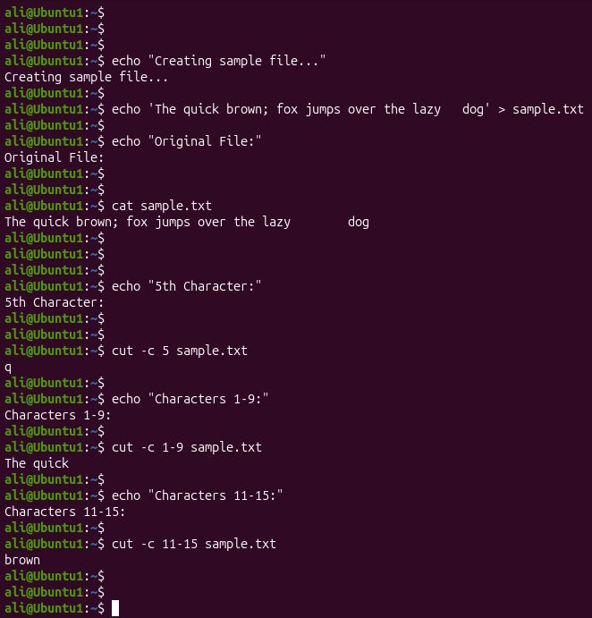
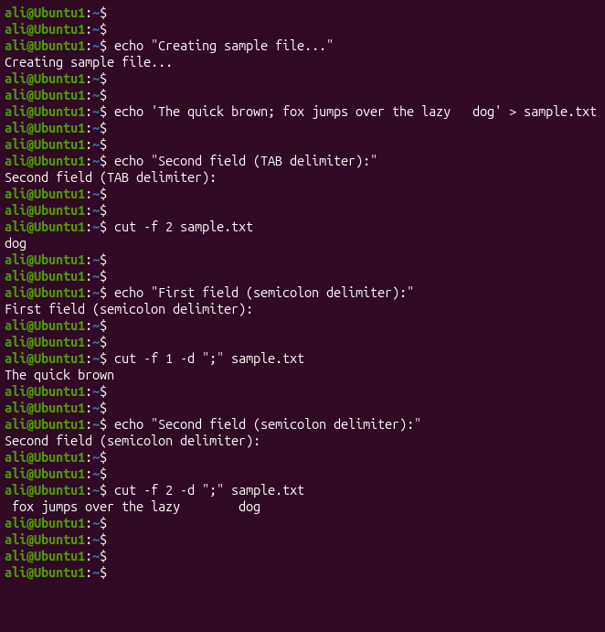

# Linux Project 08 - cut (Extract Text)

## Description

In a real-world Linux environment, system administrators, DevOps engineers, and IT support staff often work with large text files, configuration files, logs, and reports.

The `cut` command allows administrators to extract specific characters or fields from text files. It is commonly used when processing structured data such as log files, CSV files, and configuration files.

---

## Objective

Learn how to use the `cut` command to extract characters, fields, and delimited text from files.

---

## Company Scenario

You have recently joined **TechSolutions Ltd.** as a **Junior Linux System Administrator**.

Your team manages configuration files, reports, and log files that contain structured information.

Your manager asks you to extract specific information from text files using the `cut` command before generating reports.

Your task is to complete the following practice projects.

---

## What is `cut`?

The `cut` command extracts selected portions of text from each line of a file.

It can extract:

- Characters
- Fields
- Delimited text

### Syntax

```bash
cut [OPTION] FILE
```

### Example

```bash
cut -c 5 sample.txt
```

---

# Project 1 – Extract Characters from a File

### Task

Create a sample file and extract specific characters from each line using the `cut` command.

### Create the Sample File

```bash
echo 'The quick brown; fox jumps over the lazy	dog' > sample.txt
```

> **Note:** Press **Ctrl + V**, then **Tab** between **lazy** and **dog** to insert a real TAB character.

### Commands

```bash
cat sample.txt

cut -c 5 sample.txt

cut -c 1-9 sample.txt

cut -c 11-15 sample.txt
```

### Expected Output

```text
q

The quick

brown
```

---

# Project 2 – Extract Fields Using Delimiters

### Task

Extract specific fields from the file using both the default TAB delimiter and a custom delimiter.

### Commands

Extract the second field using the TAB delimiter:

```bash
cut -f 2 sample.txt
```

Extract the first field using the semicolon delimiter:

```bash
cut -f 1 -d ";" sample.txt
```

Extract the second field using the semicolon delimiter:

```bash
cut -f 2 -d ";" sample.txt
```

### Expected Output

```text
dog

The quick brown

 fox jumps over the lazy	dog
```

---

## Screenshots

### Project 1



---

### Project 2



---

## What I Learned

- Use the `cut` command to extract text from files.

- Extract individual characters using `-c`.

- Extract character ranges.

- Extract fields using `-f`.

- Use the default TAB delimiter.

- Specify custom delimiters with `-d`.

- Process structured text files efficiently.

- Prepare text for reporting and automation.

- Improve Linux text-processing skills.

- Apply `cut` in real-world system administration tasks.