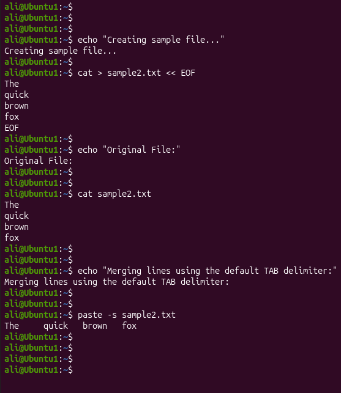
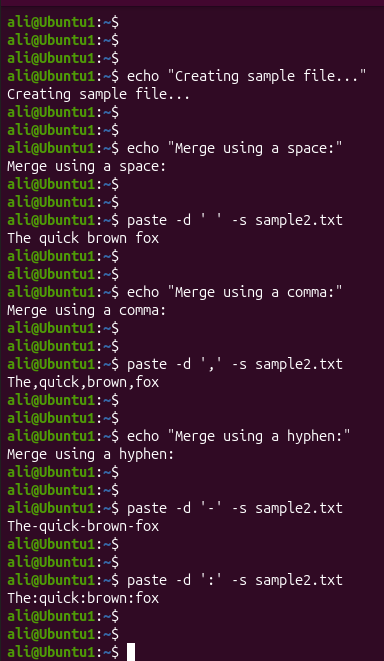

# Linux Project 07 - paste (Merge Lines)

## Description

In a real-world Linux environment, system administrators, DevOps engineers, and IT support staff often need to combine text from files into a single line or merge multiple files for reporting and automation.

The `paste` command helps administrators merge lines from one or more files using a specified delimiter. It is commonly used when formatting reports, combining datasets, and preparing data for scripts.

---

## Objective

Learn how to use the `paste` command to merge lines from files and customize the output using different delimiters.

---

## Company Scenario

You have recently joined **TechSolutions Ltd.** as a **Junior Linux System Administrator**.

Your team manages server reports and text files that must be formatted before being sent to other departments.

Your manager asks you to use the `paste` command to combine multiple lines into a single line and customize the separator between each field.

Your task is to complete the following practice projects.

---

## What is `paste`?

The `paste` command merges lines from one or more files.

By default, it separates merged text using a **TAB** character, but you can specify a custom delimiter.

### Syntax

```bash
paste [OPTION] FILE
```

### Example

```bash
paste -s sample2.txt
```

---

# Project 1 – Merge Lines into a Single Line

### Task

Create a sample file and merge all lines into one line using the default TAB delimiter.

### Create the Sample File

```bash
cat > sample2.txt
```

Type:

```text
The
quick
brown
fox
```

Press:

```text
Ctrl + D
```

### Commands

```bash
cat sample2.txt

paste -s sample2.txt
```

### Expected Output

```text
The    quick    brown    fox
```

> **Note:** The words are separated by **TAB** characters.

---

# Project 2 – Merge Lines Using a Custom Delimiter

### Task

Merge all lines into one line using a space instead of the default TAB delimiter.

### Commands

```bash
paste -d ' ' -s sample2.txt
```

You can also experiment with other delimiters:

```bash
paste -d ',' -s sample2.txt

paste -d '-' -s sample2.txt

paste -d ':' -s sample2.txt
```

### Expected Output

Using a space:

```text
The quick brown fox
```

Using a comma:

```text
The,quick,brown,fox
```

Using a hyphen:

```text
The-quick-brown-fox
```

---

## Screenshots

### Project 1



---

### Project 2



---

## What I Learned

- Use the `paste` command to merge lines from files.

- Merge an entire file into a single line using `-s`.

- Understand that the default delimiter is a TAB.

- Change delimiters using the `-d` option.

- Format text files for reports and automation.

- Prepare structured text for scripting.

- Improve Linux text-processing skills.

- Apply the `paste` command in real-world Linux administration tasks.