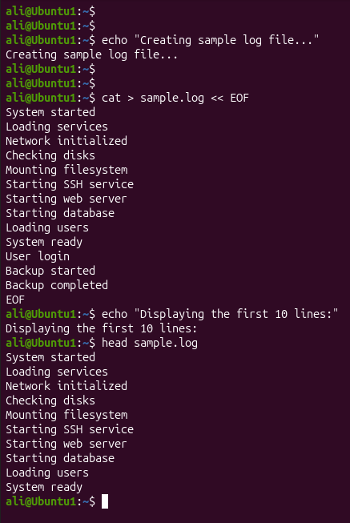
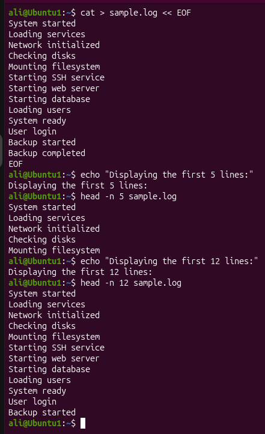

# Linux Project 08 - head (View the Beginning of Files)

## Description

In a real-world Linux environment, system administrators, DevOps engineers, and IT support staff often work with large log files, configuration files, and reports.

Instead of opening an entire file, administrators frequently use the `head` command to quickly inspect the beginning of a file. This is especially useful when checking log files, verifying configuration headers, or reviewing the first few records in a report.

---

## Objective

Learn how to use the `head` command to quickly view the beginning of text files and customize the number of displayed lines.

---

## Company Scenario

You have recently joined **TechSolutions Ltd.** as a **Junior Linux System Administrator**.

Your team manages Linux servers that generate large log files every day.

Before troubleshooting an issue, your manager asks you to inspect the beginning of several log files without opening the entire file.

Your task is to complete the following practice projects.

---

## What is `head`?

The `head` command displays the first part of a file.

By default, it displays the **first 10 lines**, but you can specify a different number of lines using the `-n` option.

### Syntax

```bash
head [OPTION] FILE
```

### Example

```bash
head sample.txt
```

---

# Project 1 – View the Beginning of a File

### Task

Create a sample log file and display its first 10 lines using the default behavior of the `head` command.

### Create the Sample File

```bash
cat > sample.log
```

Type:

```text
System started
Loading services
Network initialized
Checking disks
Mounting filesystem
Starting SSH service
Starting web server
Starting database
Loading users
System ready
User login
Backup started
Backup completed
```

Press:

```text
Ctrl + D
```

### Commands

```bash
cat sample.log

head sample.log
```

### Expected Output

```text
System started
Loading services
Network initialized
Checking disks
Mounting filesystem
Starting SSH service
Starting web server
Starting database
Loading users
System ready
```

---

# Project 2 – Display a Specific Number of Lines

### Task

Display only the first 5 lines and then the first 12 lines of the log file.

### Commands

```bash
head -n 5 sample.log

head -n 12 sample.log
```

### Expected Output

For the first 5 lines:

```text
System started
Loading services
Network initialized
Checking disks
Mounting filesystem
```

For the first 12 lines:

```text
System started
Loading services
Network initialized
Checking disks
Mounting filesystem
Starting SSH service
Starting web server
Starting database
Loading users
System ready
User login
Backup started
```

---

## Screenshots

### Project 1



---

### Project 2



---

## What I Learned

- Use the `head` command to view the beginning of a file.

- Understand that `head` displays the first **10 lines** by default.

- Display a specific number of lines using the `-n` option.

- Quickly inspect large log files.

- Verify configuration files without opening the entire file.

- Improve Linux file inspection skills.

- Apply the `head` command in real-world system administration tasks.

- Work more efficiently with large text files.