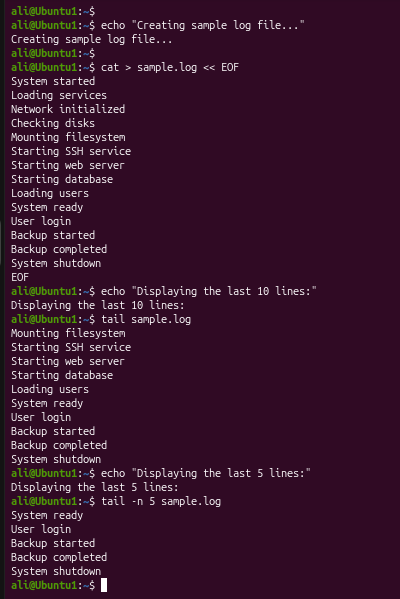
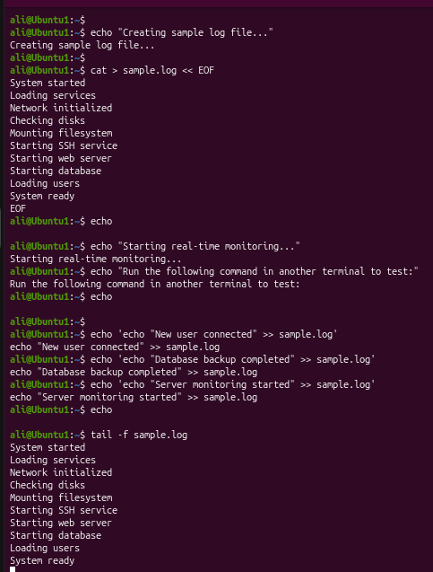

# Linux Project 09 - tail (View the End of Files)

## Description

In a real-world Linux environment, system administrators, DevOps engineers, and IT support staff frequently work with log files that are constantly updated.

Instead of opening an entire file, administrators use the `tail` command to quickly view the most recent entries. It is especially useful for troubleshooting server issues, monitoring application logs, and checking system activity.

One of its most powerful features is the **follow mode (`-f`)**, which displays new lines as they are added to a file in real time.

---

## Objective

Learn how to use the `tail` command to view the end of text files, display a specific number of lines, and monitor files in real time.

---

## Company Scenario

You have recently joined **TechSolutions Ltd.** as a **Junior Linux System Administrator**.

Your team manages Linux servers that generate system logs throughout the day.

Your manager asks you to inspect the most recent log entries and monitor a log file while new events are being written.

Your task is to complete the following practice projects.

---

## What is `tail`?

The `tail` command displays the last part of a file.

By default, it displays the **last 10 lines**, but you can display any number of lines using the `-n` option.

It also supports **real-time monitoring** using the `-f` (follow) option.

### Syntax

```bash
tail [OPTION] FILE
```

### Example

```bash
tail sample.log
```

---

# Project 1 – View the End of a File

### Task

Create a sample log file and display its last 10 lines using the default behavior of the `tail` command.

### Create the Sample File

```bash
cat > sample.log
```

Type:

```text
System started
Loading services
Network initialized
Checking disks
Mounting filesystem
Starting SSH service
Starting web server
Starting database
Loading users
System ready
User login
Backup started
Backup completed
System shutdown
```

Press:

```text
Ctrl + D
```

### Commands

```bash
cat sample.log

tail sample.log

tail -n 5 sample.log
```

### Expected Output

Default (`tail`):

```text
Mounting filesystem
Starting SSH service
Starting web server
Starting database
Loading users
System ready
User login
Backup started
Backup completed
System shutdown
```

Using `tail -n 5`:

```text
System ready
User login
Backup started
Backup completed
System shutdown
```

---

# Project 2 – Monitor a File in Real Time

### Task

Monitor a log file while new entries are added.

### Terminal 1

Start monitoring the file.

```bash
tail -f sample.log
```

### Terminal 2

Append new log entries.

```bash
echo "New user connected" >> sample.log

echo "Database backup completed" >> sample.log

echo "Server monitoring started" >> sample.log
```

### Expected Output

The first terminal automatically displays:

```text
New user connected
Database backup completed
Server monitoring started
```

Stop monitoring by pressing:

```text
Ctrl + C
```

---

## Screenshots

### Project 1



---

### Project 2



---

## What I Learned

- Use the `tail` command to display the end of a file.

- Understand that `tail` displays the last **10 lines** by default.

- Display a specific number of lines using the `-n` option.

- Monitor files in real time using `tail -f`.

- Inspect system logs efficiently.

- Troubleshoot Linux servers using recent log entries.

- Improve Linux file monitoring skills.

- Apply the `tail` command in real-world system administration tasks.