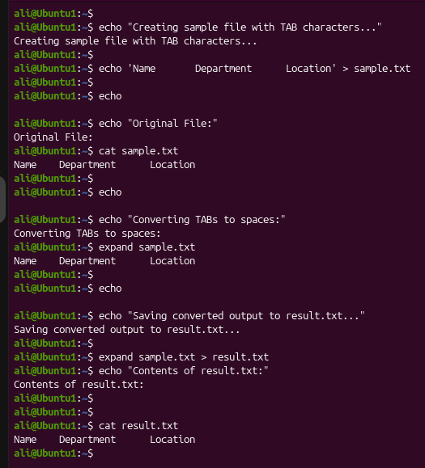
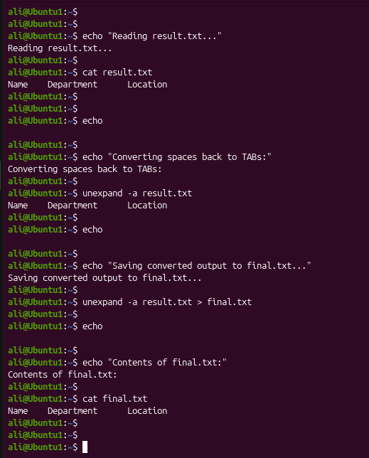

# Linux Project 10 - expand and unexpand (Convert Tabs and Spaces)

## Description

In a real-world Linux environment, system administrators, DevOps engineers, and software developers often work with configuration files, scripts, and source code where consistent indentation is important.

Different text editors may display **TAB** characters differently, causing files to appear misaligned. Linux provides the `expand` and `unexpand` commands to convert between tabs and spaces, helping maintain consistent formatting across different systems.

---

## Objective

Learn how to use the `expand` and `unexpand` commands to convert tabs into spaces and spaces back into tabs.

---

## Company Scenario

You have recently joined **TechSolutions Ltd.** as a **Junior Linux System Administrator**.

Your team shares configuration files and shell scripts with developers who use different text editors.

Your manager asks you to standardize file formatting by converting tabs into spaces and, when necessary, convert spaces back into tabs.

Your task is to complete the following practice projects.

---

## What are `expand` and `unexpand`?

The **expand** command converts **TAB characters into spaces**.

The **unexpand** command converts **spaces back into TAB characters**.

These commands help maintain consistent formatting in configuration files, scripts, and text documents.

---

## Syntax

### expand

```bash
expand [OPTION] FILE
```

### unexpand

```bash
unexpand [OPTION] FILE
```

### Example

```bash
expand sample.txt
```

---

# Project 1 – Convert Tabs into Spaces

### Task

Create a sample file containing TAB characters and convert them into spaces.

### Create the Sample File

```bash
echo 'Name	Department	Location' > sample.txt
```

> **Note:** Press **Ctrl + V**, then **Tab** between each word to insert a real TAB character.

### Commands

```bash
cat sample.txt

expand sample.txt

expand sample.txt > result.txt

cat result.txt
```

### Expected Output

```text
Name        Department        Location
```

The TAB characters are replaced with spaces.

---

# Project 2 – Convert Spaces Back into Tabs

### Task

Convert the spaces in the formatted file back into TAB characters.

### Commands

```bash
cat result.txt

unexpand -a result.txt

unexpand -a result.txt > final.txt

cat final.txt
```

### Expected Output

```text
Name	Department	Location
```

The spaces are converted back into TAB characters.

---

## Screenshots

### Project 1



---

### Project 2



---

## What I Learned

- Use the `expand` command to convert TAB characters into spaces.

- Understand that `expand` replaces each TAB with spaces (8 spaces by default).

- Save formatted output using output redirection (`>`).

- Use the `unexpand` command to convert spaces back into TAB characters.

- Use the `-a` option to convert all eligible spaces into tabs.

- Improve text formatting across different editors.

- Maintain consistent indentation in Linux configuration files.

- Apply `expand` and `unexpand` in real-world Linux administration tasks.