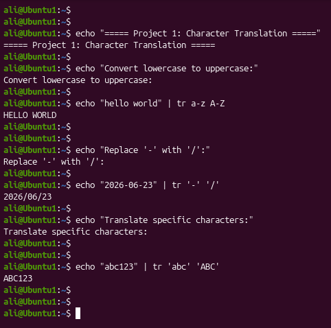
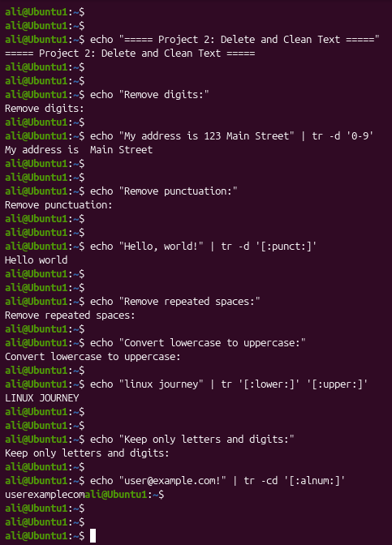

# Linux Project 15 - tr (Translate Characters)

## Description

In a real-world Linux environment, system administrators, DevOps engineers, and software developers often need to clean, transform, and format text before processing log files, configuration files, reports, or user data.

The `tr` (translate) command allows administrators to translate characters, delete unwanted characters, and squeeze repeated characters from standard input. It is a lightweight and powerful command commonly used in Linux text processing.

---

## Objective

Learn how to use the `tr` command to translate, delete, and clean text efficiently in Linux.

---

## Company Scenario

You have recently joined **TechSolutions Ltd.** as a **Junior Linux System Administrator**.

Your team manages application logs, user records, and configuration files that often contain inconsistent formatting, unnecessary punctuation, and repeated spaces.

Your manager asks you to clean and standardize text files before they are imported into the company's monitoring and reporting systems.

Your task is to complete the following practice projects.

---

## What is `tr`?

The **tr** (**Translate**) command is used to translate, delete, or squeeze characters from standard input.

Unlike commands such as `sed` or `awk`, the `tr` command works **character by character**, making it very fast for simple text processing tasks.

It is commonly used to:

- Convert lowercase letters to uppercase
- Replace one character with another
- Delete unwanted characters
- Remove repeated spaces
- Clean text before further processing

---

## Syntax

```bash
tr [OPTION] SET1 [SET2]
```

### Example

```bash
echo "hello world" | tr a-z A-Z
```

### Output

```text
HELLO WORLD
```

---

# Project 1 – Translate Characters

### Task

Convert lowercase letters into uppercase letters and replace characters in a text string.

### Commands

```bash
echo "hello world" | tr a-z A-Z

echo "2026-06-23" | tr '-' '/'

echo "abc123" | tr 'abc' 'ABC'
```

### Expected Output

```text
HELLO WORLD

2026/06/23

ABC123
```

---

# Project 2 – Delete and Clean Text

### Task

Remove unwanted characters and normalize repeated spaces in text.

### Commands

```bash
echo "My address is 123 Main Street" | tr -d '0-9'

echo "Hello, world!" | tr -d '[:punct:]'

echo "Hello      World,   how   are   you?" | tr -s ' '

echo "linux journey" | tr '[:lower:]' '[:upper:]'

echo "user@example.com!" | tr -cd '[:alnum:]'
```

### Expected Output

```text
My address is  Main Street

Hello world

Hello World, how are you?

LINUX JOURNEY

userexamplecom
```

---

## Screenshots

### Project 1



---

### Project 2



---

## What I Learned

- Use the `tr` command to translate characters.

- Convert lowercase letters to uppercase.

- Replace one character with another.

- Delete unwanted characters using `-d`.

- Remove punctuation from text.

- Squeeze repeated spaces using `-s`.

- Use character classes such as `[:lower:]`, `[:upper:]`, `[:digit:]`, and `[:punct:]`.

- Keep only specific characters using the `-c` option.

- Clean and normalize text before further processing.

- Apply the `tr` command in real-world Linux administration tasks.