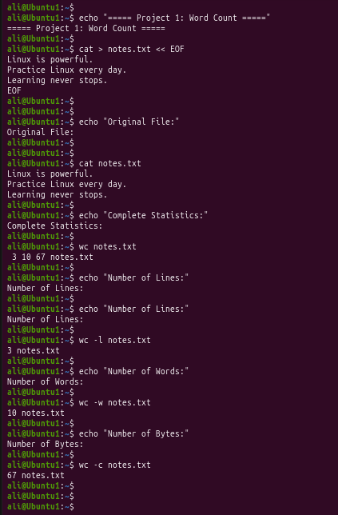
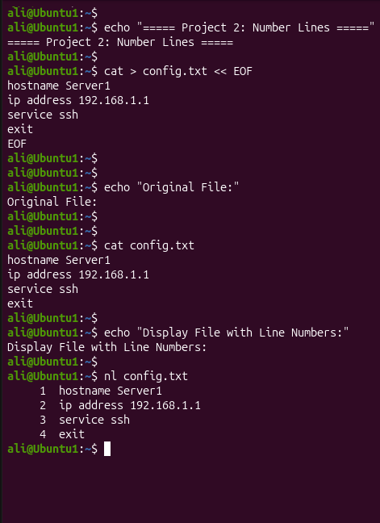

# Linux Project 15 - wc and nl (Word Count & Number Lines)

## Description

In a real-world Linux environment, system administrators, DevOps engineers, and software developers frequently analyze text files such as configuration files, log files, reports, and scripts.

The `wc` command helps administrators count the number of lines, words, and bytes in a file, while the `nl` command adds line numbers to text files, making them easier to read and troubleshoot.

These are essential Linux text-processing commands.

---

## Objective

Learn how to use the `wc` command to count file contents and the `nl` command to display line numbers in text files.

---

## Company Scenario

You have recently joined **TechSolutions Ltd.** as a **Junior Linux System Administrator**.

Your team manages Linux servers containing log files, configuration files, shell scripts, and documentation.

Your manager asks you to analyze file sizes, count the number of lines and words, and review configuration files with numbered lines before troubleshooting.

Your task is to complete the following practice projects.

---

## What are `wc` and `nl`?

The **wc** (**Word Count**) command displays information about a text file, including:

- Number of lines
- Number of words
- Number of bytes

The **nl** (**Number Lines**) command displays a file while adding line numbers to each line.

These commands help administrators inspect files quickly and accurately.

---

## Syntax

### wc

```bash
wc [OPTION] FILE
```

### nl

```bash
nl [OPTION] FILE
```

### Example

```bash
wc notes.txt

nl notes.txt
```

---

# Project 1 – Count Lines, Words, and Bytes

### Task

Create a sample text file and analyze it using different `wc` options.

### Create the Sample File

```bash
cat > notes.txt
```

Type:

```text
Linux is powerful.
Practice Linux every day.
Learning never stops.
```

Press:

```text
Ctrl + D
```

### Commands

```bash
cat notes.txt

wc notes.txt

wc -l notes.txt

wc -w notes.txt

wc -c notes.txt
```

### Expected Output

Example:

```text
3 9 59 notes.txt
```

Only Lines

```text
3 notes.txt
```

Only Words

```text
9 notes.txt
```

Only Bytes

```text
59 notes.txt
```

> **Note:** The exact word and byte counts may vary slightly depending on your file contents.

---

# Project 2 – Display Line Numbers

### Task

Review a configuration file by displaying line numbers.

### Create the Sample File

```bash
cat > config.txt
```

Type:

```text
hostname Server1
ip address 192.168.1.1
service ssh
exit
```

Press:

```text
Ctrl + D
```

### Commands

```bash
cat config.txt

nl config.txt
```

### Expected Output

```text
     1  hostname Server1
     2  ip address 192.168.1.1
     3  service ssh
     4  exit
```

---

## Screenshots

### Project 1



---

### Project 2



---

## What I Learned

- Use the `wc` command to count file contents.

- Display the number of lines using `wc -l`.

- Display the number of words using `wc -w`.

- Display the number of bytes using `wc -c`.

- Analyze text files quickly using `wc`.

- Use the `nl` command to display line numbers.

- Review scripts and configuration files more easily.

- Apply the `wc` and `nl` commands in real-world Linux administration tasks.