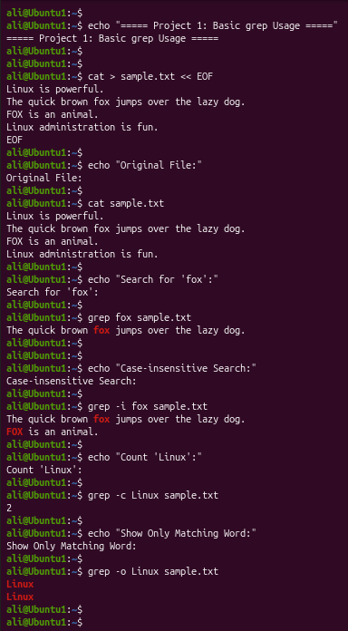
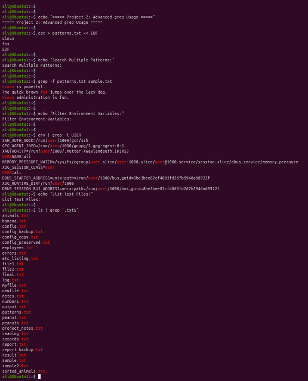

# Linux Project 16 - grep (Global Regular Expression Print)

## Description

In a real-world Linux environment, system administrators, DevOps engineers, cybersecurity analysts, and software developers frequently search through configuration files, log files, scripts, and reports to find specific information.

The `grep` command is one of the most powerful Linux text-processing utilities. It searches files or command output for lines that match a specific word or pattern, making troubleshooting and system administration much faster.

---

## Objective

Learn how to use the `grep` command to search text files, filter command output, and locate specific patterns efficiently.

---

## Company Scenario

You have recently joined **TechSolutions Ltd.** as a **Junior Linux System Administrator**.

Your team manages Linux servers containing thousands of log entries, configuration files, and user records.

Your manager asks you to search configuration files for specific settings, locate error messages inside log files, and filter command output using the `grep` command.

Your task is to complete the following practice projects.

---

## What is `grep`?

The **grep** (**Global Regular Expression Print**) command searches files or standard input for lines that match a specified word or pattern.

It is commonly used to:

- Search configuration files
- Find log entries
- Filter command output
- Locate usernames
- Search for errors
- Perform pattern matching

The `grep` command is one of the most frequently used Linux commands by system administrators.

---

## Syntax

```bash
grep [OPTION] PATTERN FILE
```

### Example

```bash
grep fox sample.txt
```

### Output

```text
The quick brown fox jumps over the lazy dog.
```

---

# Project 1 – Search for Text in Files

### Task

Create a sample text file and search for different words using various `grep` options.

### Create the Sample File

```bash
cat > sample.txt
```

Type:

```text
Linux is powerful.
The quick brown fox jumps over the lazy dog.
FOX is an animal.
Linux administration is fun.
```

Press:

```text
Ctrl + D
```

### Commands

```bash
cat sample.txt

grep fox sample.txt

grep -i fox sample.txt

grep -c Linux sample.txt

grep -o Linux sample.txt
```

### Expected Output

Search for "fox"

```text
The quick brown fox jumps over the lazy dog.
```

Case-Insensitive Search

```text
The quick brown fox jumps over the lazy dog.
FOX is an animal.
```

Count Matches

```text
2
```

Show Only Matching Word

```text
Linux
Linux
```

---

# Project 2 – Search Multiple Patterns and Filter Command Output

### Task

Create a pattern file, search for multiple patterns, and filter command output using pipes.

### Create the Pattern File

```bash
cat > patterns.txt
```

Type:

```text
Linux
fox
```

Press:

```text
Ctrl + D
```

### Commands

```bash
grep -f patterns.txt sample.txt

env | grep -i USER

ls | grep '.txt$'
```

### Expected Output

Search Using Pattern File

```text
Linux is powerful.
The quick brown fox jumps over the lazy dog.
Linux administration is fun.
```

Filter Environment Variables

```text
USER=your_username
```

List Text Files

```text
patterns.txt
sample.txt
```

> **Note:** The actual environment variables and filenames displayed may vary depending on your Linux system.

---

## Screenshots

### Project 1



---

### Project 2



---

## What I Learned

- Use the `grep` command to search for text in files.

- Perform case-insensitive searches using `grep -i`.

- Count matching lines using `grep -c`.

- Display only matching text using `grep -o`.

- Search for multiple patterns using `grep -f`.

- Filter command output using pipes (`|`).

- Search environment variables using `env | grep`.

- Find files matching a pattern using `ls | grep`.

- Understand that `grep` is one of the most important Linux commands for system administration.

- Apply the `grep` command in real-world Linux administration tasks.